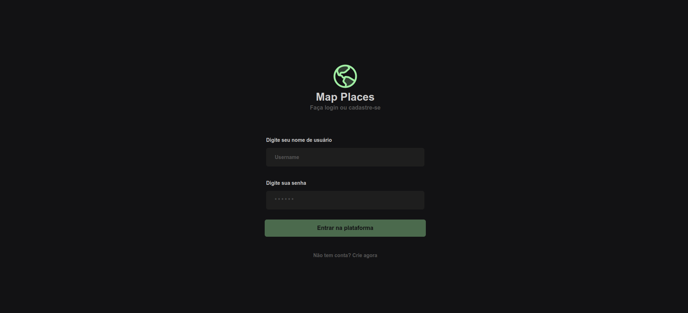
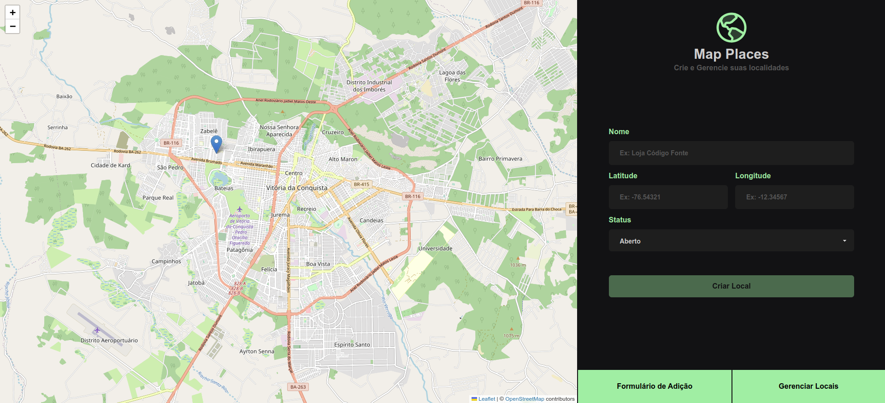

# Map Places

<details>
  <summary><strong>🖥️ Telas da Aplicação</strong></summary><br />

  <h3>Tela de Login</h3><br />

  

  <h3>Tela de Gerenciamento do mapa</h3><br />

  

</details>
<br />

# Sobre o Projeto
Este projeto foi feito para gerenciar de estabelecimentos (lojas, residência, parques, etc), 
onde é possível cadastrar, atualizar, visualizar e deletar locais que são atrelados a um usuário.

## Ferramentas utilizadas

> Linguagens: `HTML/CSS` `Javascript`

> Frameworks: `Tailwind CSS, Express.js`

> Bibliotecas: `React`, `Phosphor React`, `Leaflet`, `React Leaflet`, `JWT`, `Joi`, `Bcryptjs`, `Sequelize`, `Axios`, `React Router`

> Plugins: `Daisyui`

> Linters: `Eslint`

> Banco de Dados: `MySQL`

### [Link da Aplicação](https://map-places.vercel.app/)

## Para rodar o projeto localmente:

1 - **Clone o repositório**
```bash
git clone git@github.com:imgeff/map-places.git
```

## Executando aplicação
### Requisitos
- [Node:v16 ou +](https://nodejs.org/en/download/)
- [MySQL](https://www.devmedia.com.br/instalando-e-configurando-a-nova-versao-do-mysql/25813)

Rode a aplicação:

 - Abra um terminal na raiz do projeto
 - Instale as dependências comando `npm run install:all`
 - No mesmo terminal execute o comando `npm run start:back` para iniciar o servidor back-end
 - Abra um segundo terminal e execute o comando `npm run start:front` para iniciar o servidor front-end
 - E por último acesse o endereço http://localhost:5173/ no navegador para visualizar a aplicação

## Observação
Edite o arquivo `.env.example` alterando os valores das variáveis de acordo com seu MySQL e 
certifique que ele esteja startado.
